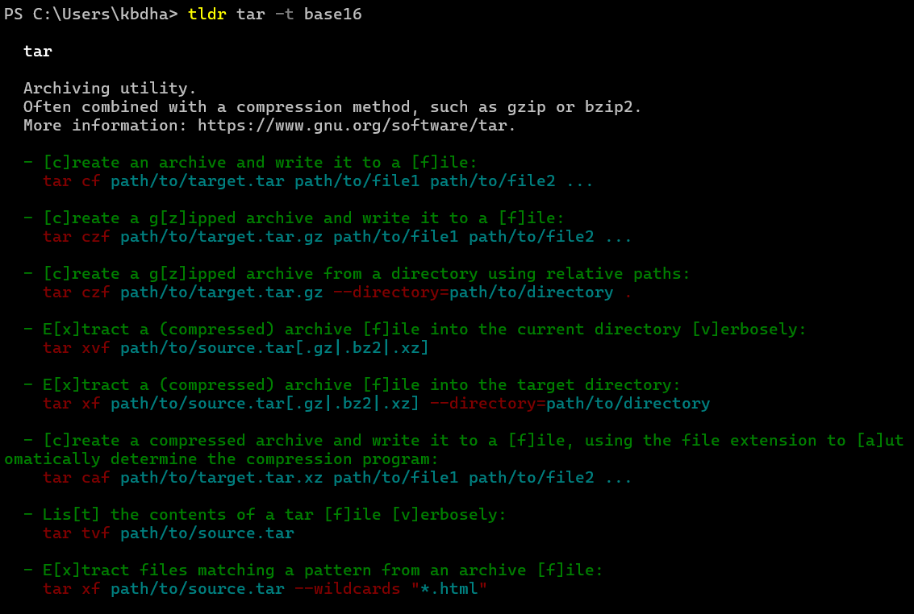

# tldr-node-client

[![NPM version][npm-image]][npm-url]
[![GitHub Action Build Status][gh-actions-image]][gh-actions-url]
[![Matrix chat][matrix-image]][matrix-url]

A `Node.js` based command-line client for [tldr](https://github.com/tldr-pages/tldr).



_tldr-node-client's output for the `tar` page, using a custom color theme_

## Installing

```bash
npm install -g tldr
```

## Usage

To see tldr pages:

- `tldr <command>` show examples for this command
- `tldr <command> --platform=<osx, darwin, macos, freebsd, linux, netbsd, openbsd, sunos, android, windows, win32>` show command page for the given platform
- `tldr --android <command>` show command page for Android
- `tldr --darwin <command>` show command page for darwin (macOS)
- `tldr --freebsd <command>` show command page for FreeBSD
- `tldr --linux <command>` show command page for Linux
- `tldr --macos <command>` show command page for macOS
- `tldr --netbsd <command>` show command page for NetBSD
- `tldr --openbsd <command>` show command page for OpenBSD
- `tldr --osx <command>` show command page for osx (macOS)
- `tldr --sunos <command>` show command page for SunOS
- `tldr --win32 <command>` show command page for win32 (Windows)
- `tldr --windows <command>` show command page for Windows
- `tldr --search "<query>"` search all pages for the query
- `tldr --list` show all pages for current platform
- `tldr --list-all` show all available pages
- `tldr --random` show a page at random
- `tldr --random-example` show a single random example
- `tldr --markdown` show the original markdown format page

The client caches a copy of all pages locally, in `~/.tldr`.
There are more commands to control the local cache:

- `tldr --update` download the latest pages and generate search index
- `tldr --clear-cache` delete the entire local cache

As a contributor, you might also need the following commands:

- `tldr --render <path>` render a local page for testing purposes

Tldr pages defaults to showing pages in the current language of the operating system, or English if that's not available. To view tldr pages for a different language, set an environment variable `LANG` containing a valid [POSIX locale](https://www.gnu.org/software/gettext/manual/html_node/Locale-Names.html#Locale-Names) (such as `zh`, `pt_BR`, or `fr`) and then run the above commands as usual. In most `*nix` systems, this variable will already be set.

It is suggested that the `LANG` environment variable be set system-wide if this isn't already the case. Users without `sudo` access can set it locally in their `~/.profile`.

- `LANG=zh tldr <command>`

For the list of available translations, please refer to the main [tldr](https://github.com/tldr-pages/tldr) repo.

## Configuration

You can configure the `tldr` client by adding a `.tldrrc` file in your HOME directory. You can copy the contents of the `config.json` file from the repo to get the basic structure to start with, and modify it to suit your needs.

The default color theme is the one named `"simple"`. You can change the theme by assigning a different value to the `"theme"` variable -- either to one of the pre-configured themes, or to a new theme that you have previously created in the `"themes"` section. Note that the colors and text effects you can choose are limited. Refer to the [chalk documentation](https://github.com/chalk/chalk#styles) for all options.

```json
{
  "themes": {
    "ocean": {
      "commandName": "bold, cyan",
      "mainDescription": "",
      "exampleDescription": "green",
      "exampleCode": "cyan",
      "exampleToken": "dim"
    },
    "myOwnCoolTheme": {
      "commandName": "bold, red",
      "mainDescription": "underline",
      "exampleDescription": "yellow",
      "exampleCode": "underline, green",
      "exampleToken": ""
    }
  },
  "theme": "ocean"
}
```

If you regularly need pages for a different platform (e.g. Linux),
you can put it in the config file:

```json
{
  "platform": "linux"
}
```

The default platform value can be overwritten with command-line option:

```shell
tldr du --platform=<osx>
```

As a contributor, you can also point to your own fork containing the `tldr.zip` file. The file is just a zipped version of the entire tldr repo:

```js
{
  "repository": "http://myrepo/assets/tldr.zip"
}
```

By default, a cache update is performed anytime a page is not found for a command. To prevent this behavior,
you can set the configuration variable `skipUpdateWhenPageNotFound` to `true` (defaults to `false`):

```js
{
  "skipUpdateWhenPageNotFound": true
}
```

## Command-line Autocompletion

Currently we only support command-line autocompletion for zsh
and bash. Pull requests for other shells are most welcome!

### zsh

It's easiest for
[oh-my-zsh](https://github.com/robbyrussell/oh-my-zsh)
users, so let's start with that.

```zsh
mkdir -p $ZSH_CUSTOM/plugins/tldr
ln -s bin/completion/zsh/_tldr $ZSH_CUSTOM/plugins/tldr/_tldr
```

Then add tldr to your oh-my-zsh plugins,
usually defined in `~/.zshrc`,
resulting in something looking like this:

```zsh
plugins=(git tmux tldr)
```

Alternatively, using [zplug](https://github.com/zplug/zplug)

```zsh
zplug "tldr-pages/tldr-node-client", use:bin/completion/zsh
```

Fret not regular zsh user!
Copy or symlink `bin/completion/zsh/_tldr` to
`my/completions/_tldr`
(note the filename).
Then add the containing directory to your fpath:

```zsh
fpath=(my/completions $fpath)
```

### Bash

```bash
ln -s bin/completion/bash/tldr ~/.tldr-completion.bash
```

Now add the following line to our bashrc file:

```bash
source ~/.tldr-completion.bash
```

## FAQ

### Installation Issues

- If you are trying to install as non-root user (`npm install -g tldr`) and get something like:

```text
Error: EACCES: permission denied, access '/usr/local/lib/node_modules/tldr'
```

Then most probably your npm's default installation directory has improper permissions. You can resolve it by clicking [here](https://docs.npmjs.com/getting-started/fixing-npm-permissions)

- If you are trying to install as a root user (`sudo npm install -g tldr`) and get something like:

```shell
as root ->
gyp WARN EACCES attempting to reinstall using temporary dev dir "/usr/local/lib/node_modules/tldr/node_modules/webworker-threads/.node-gyp"
gyp WARN EACCES user "root" does not have permission to access the dev dir "/usr/local/lib/node_modules/tldr/node_modules/webworker-threads/.node-gyp/8.9.1"
```

You need to add the option `--unsafe-perm` to your command. This is because when npm goes to the postinstall step, it downgrades the permission levels to "nobody". Probably you should fix your installation directory permissions and install as a non-root user in the first place.

- If you see an error related to `webworker-threads` like:

```text
/usr/local/lib/node_modules/tldr/node_modules/natural/lib/natural/classifiers/classifier.js:32
    if (e.code !== 'MODULE_NOT_FOUND') throw e;
```

Most probably you need to reinstall `node-gyp` and `webworker-threads`. Try this -

```shell
sudo -H npm uninstall -g tldr
sudo -H npm uninstall -g webworker-threads
npm install -g node-gyp
npm install -g webworker-threads
npm install -g tldr
```

For further context, take a look at this [issue](https://github.com/tldr-pages/tldr-node-client/issues/179)

#### Colors under Cygwin

Colors can't be shown under Mintty or PuTTY, because the dependency `colors.js` has a bug.
Please show support to [this pull request](https://github.com/Marak/colors.js/pull/154), so it can be merged.

Meanwhile, you can do one of the following to fix this issue:

- Add the following script to your shell's rc file (`.zshrc`, `.bashrc`, etc.): (RECOMMENDED)

```bash
tldr_path="$(which tldr)"
function tldr() {
  eval "$tldr_path" $@ "--color"
}
```

- Add `alias tldr="tldr --color=true"` to your shell's rc file.
- Prepend `process.stdout.isTTY = true;` to `tldr.js` (NOT RECOMMENDED)
- Fix `colors.js`'s logic (NOT RECOMMENDED)
  - Go to `%appdata%\npm\node_modules\tldr\node_modules\colors\lib\system\`
  - Overwrite `supports-colors.js` with [supports-colors.js](https://raw.githubusercontent.com/RShadowhand/colors.js/master/lib/system/supports-colors.js) from my repo.
- Use `CMD.exe`.

## Contributing

Contribution are most welcome!
Have a look [over here](https://github.com/tldr-pages/tldr-node-client/blob/master/.github/CONTRIBUTING.md)
for a few rough guidelines.

[npm-url]: https://www.npmjs.com/package/tldr
[npm-image]: https://img.shields.io/npm/v/tldr.svg
[gh-actions-url]: https://github.com/tldr-pages/tldr-node-client/actions?query=workflow%3ATest+branch%3Amaster
[gh-actions-image]: https://img.shields.io/github/actions/workflow/status/tldr-pages/tldr-node-client/test.yml?branch=main
[matrix-url]: https://matrix.to/#/#tldr-pages:matrix.org
[matrix-image]: https://img.shields.io/matrix/tldr-pages:matrix.org?label=chat+on+matrix
